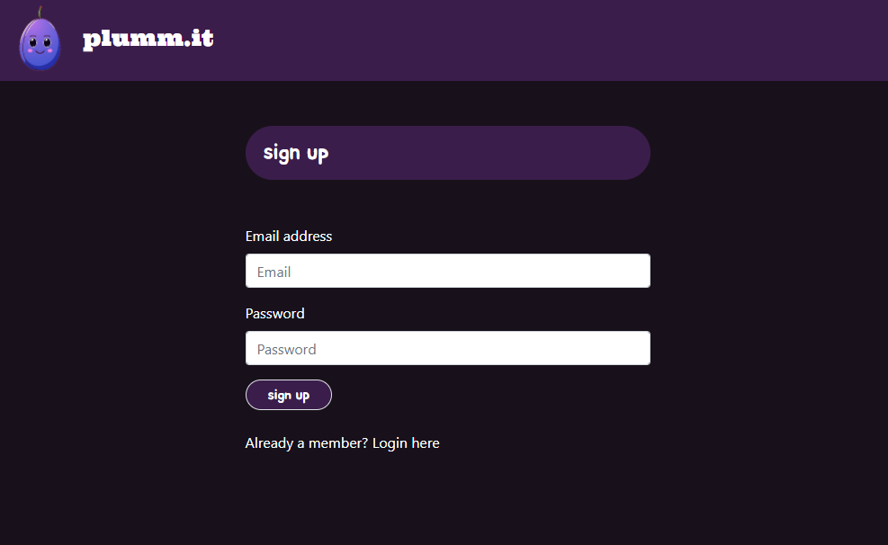

# plumm.it

## Summary

A forum website that allows users to create and comment on threads with sign up and authentication. 

## Table of Contents

1. [Contributors](#contributors)
2. [Technologies](#technologies)
3. [Usage](#usage)
4. [License](#license)
5. [Contributing](#contributing)
6. [Questions](#questions)

## Contributors

<a href="https://github.com/tldav" target="blank">Thomas Davis</a>
 
<a href="https://github.com/marcustate" target="blank">Marcus Tate</a>

## Technologies

JavaScript
jQuery
Handlebars
Tailwind Css
Node
Express
MySQL
Sequelize
bcrypt

Deployed using Heroku

## Usage

### To Install

`npm i`

### To Start

`npm start`

Find the deployed application [here](https://warm-plains-89008.herokuapp.com/)

## License

[MIT](https://choosealicense.com/licenses/mit/)

## Contributing

If you would like to contribute to this project you can:

-   Either fork or clone this repo [here](https://github.com/tldav/project-purple)
-   Add any changes/upgrades you would like
-   Update the README with changes made, new technologies used, etc.
-   Create a new pull request [here](https://github.com/tldav/project-purple/compare)

## Questions

If you have questions about this application, please reach out to the creators via the email on their respective GitHub profiles, provided above.

